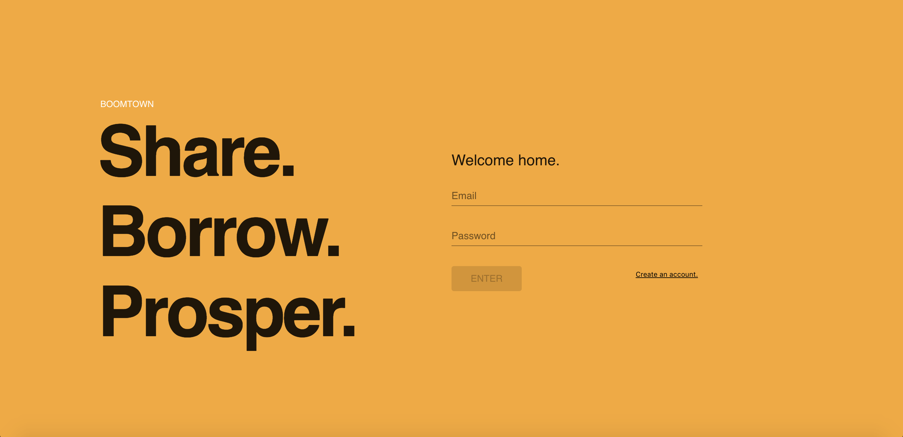
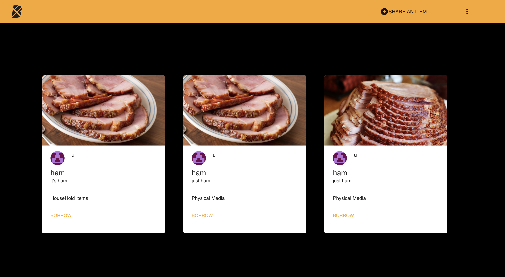

# Boomtown 🏙

Boomtown is a item sharing web application where user can post items and borrow others'. The app has both client and server side code.

## Screenshots





## Server

## NOTE: Please note that a database is required to run the server.

Commands must be run from the `server` directory:

### Installation

- Clone this repo

```bash
cd server directory
npm install
```

### Run

```bash
npm run start:dev
```

## Client

Commands must be run from the `client` directory:

### Installation

```bash
cd client directory
npm install
```

### Run

```bash
npm start
```

## Technologies Used

- JavaScript
- PostgreSQL
  - SQL
- GraphQL
  - Schema Definition Language (SDL)
- Express
- Material-UI
- React
  - JSX
  - Final Form
  - Gravitar
- Redux
- bycrypt
- JSON web tokens
- Apollo Client
- Apollo Server

## Lessons Learned

- Intro to React
- React Router
- Asynchronous JavaScript
- Redux
- Using React with Redux
- Create a database using SQL queries.
- Create queries and resolvers.
- Server and Client side authentication
- Using material-ui to style
- Creating forms with React Final Form

## Author

[Kyle Tecson](https://www.linkedin.com/in/kyle-tecson-9b6952175/)
